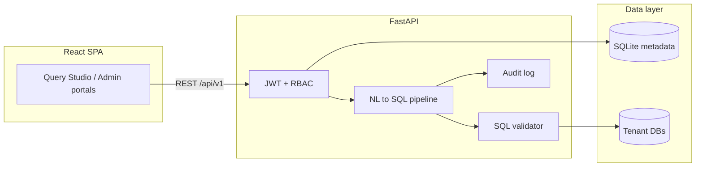

# AtlasIQ

**Full-stack AI analytics application** — natural language to SQL with role-based access, audit logging, and automated reports.

Built as an end-to-end portfolio project to demonstrate backend API design, React front-end engineering, LLM integration, and multi-tenant security patterns relevant to data/analytics and full-stack roles.

---

## Problem

Business users need answers from relational data but often lack SQL skills. Giving everyone unrestricted database access is unsafe. AtlasIQ explores how to **translate plain-English questions into validated SQL**, enforce **per-user table permissions**, and expose **admin visibility** (audit logs, usage metrics) in one cohesive application.

---

## What this project demonstrates (interview talking points)

| Area | Implementation |
|------|----------------|
| **LLM integration** | Groq/OpenAI for NL→SQL, clarification flows, SQL error retry, cost estimation before execution |
| **Security** | JWT auth, 3-tier RBAC (platform / company admin / employee), row-level table ACL, SQL allow-list validation |
| **Backend** | FastAPI, REST API, SQLite metadata store, Pydantic schemas, background jobs, scheduled reports |
| **Frontend** | React 18, TypeScript, Vite, Tailwind — dashboards, query studio, charts (Recharts), modal workflows |
| **Data** | SQLite upload + PostgreSQL/Redshift connectors, schema sampling for large warehouses |
| **Ops** | Docker single-container deploy, Render blueprint, pytest unit tests, smoke test script |

---

## Architecture



**Query path:** question → schema context → LLM generates SQL → validator checks tables/keywords → execute → chart spec + explanation → history + optional feedback.

---

## Tech stack

- **Backend:** Python 3.11, FastAPI, SQLite, APScheduler, optional Redis/Celery
- **Frontend:** React, TypeScript, Vite, Tailwind CSS, Recharts
- **AI:** Groq API (Llama family) with OpenAI-compatible fallback
- **Deploy:** Docker, Render (`render.yaml`), Cloudflare Tunnel for local demos

---

## Quick start (local)

**Prerequisites:** Python 3.11+, Node 18+, [Groq API key](https://console.groq.com) (free tier)

```powershell
git clone https://github.com/veera-1175/atlasiq.git
cd atlasiq
copy .env.example .env
# Edit .env and set GROQ_API_KEY=...
.\run.ps1
```

- UI: http://localhost:5173  
- API: http://localhost:8000/docs  

Demo tenant is seeded automatically on first run.

### Demo accounts

| Role | Email | Password |
|------|-------|----------|
| Platform admin | `admin@atlasiq.io` | `AtlasIQ@2026` |
| Company admin | `admin@demo.acme.com` | `Demo@2026` |
| Employee | `analyst@demo.acme.com` | `Demo@2026` |

**Suggested demo flow for interviews:**

1. Log in as **employee** → Query Studio → *"Which region had the highest revenue in Q1?"* → show SQL, chart, and table ACL.
2. Log in as **company admin** → Team & Access, Data Sources, audit log.
3. Mention **SQL validation** (no `DROP`, tenant-scoped tables) and **approval workflows** (password change, table access).

---

## Project structure

```
atlasiq/
├── backend/app/
│   ├── routers/      # REST endpoints (auth, query, admin, …)
│   ├── services/     # NL→SQL pipeline, scheduler, validators
│   └── core/         # DB, permissions, config
├── frontend/src/
│   ├── components/   # Role-specific UI (admin, employee, platform)
│   └── api.ts        # Typed API client
├── backend/tests/    # Unit tests (validator, schedule, schema, …)
├── Dockerfile        # Production: UI + API on one port
└── render.yaml       # Free cloud deploy (optional)
```

---

## Scripts

| Command | Purpose |
|---------|---------|
| `.\run.ps1` | Start backend + frontend (dev) |
| `backend\venv\Scripts\python backend\scripts\smoke_test.py` | API health + login + query test |
| `backend\venv\Scripts\python -m pytest backend/tests` | Run unit tests |

---

## Deploy online (free, no domain)

See [Render Blueprint](render.yaml) for a free `*.onrender.com` URL, or run `.\scripts\tunnel.ps1` with [Cloudflare Tunnel](https://developers.cloudflare.com/cloudflare-one/connections/connect-networks/do-more-with-tunnels/trycloudflare/) to share a local demo link during interviews.

---

## Author

**Veera** — full-stack / AI engineering portfolio project.

If you are reviewing this for hiring: I can walk through the NL→SQL pipeline, RBAC model, or any module live in ~10 minutes.
