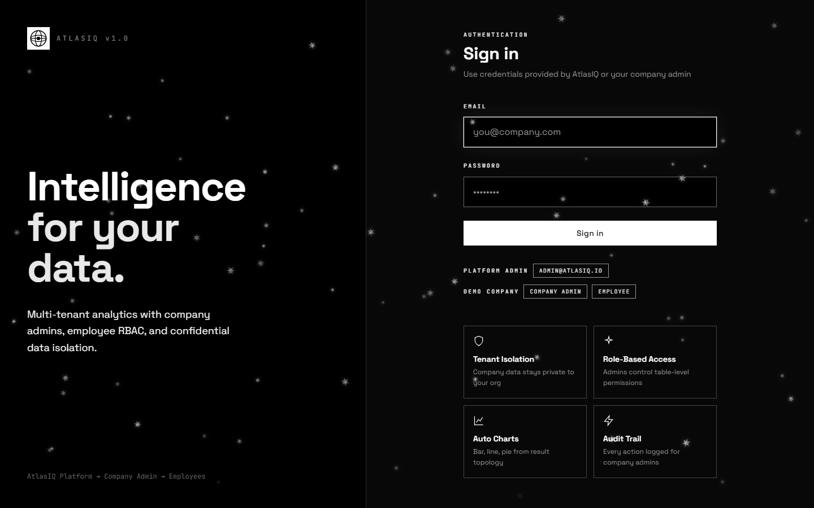
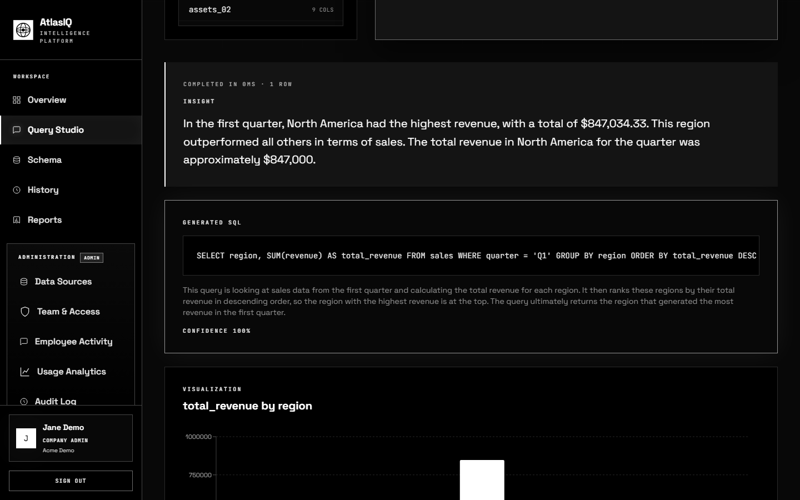
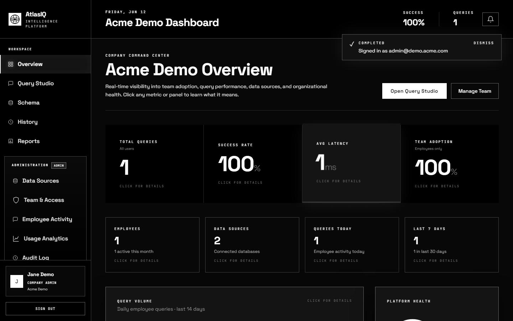
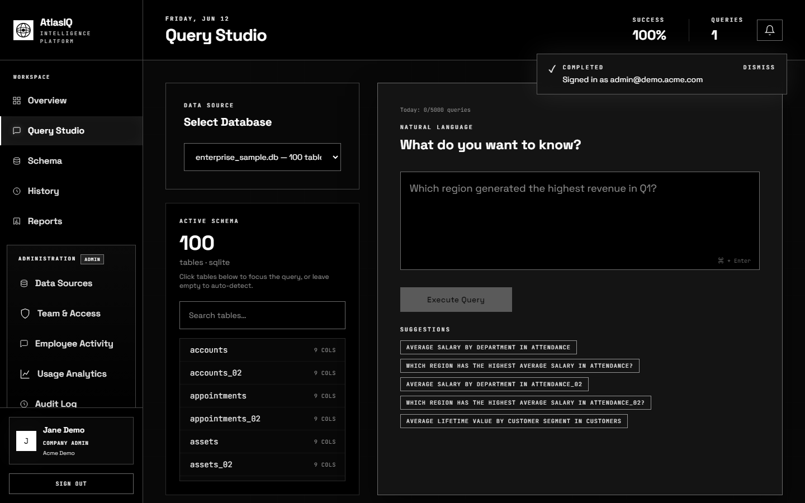
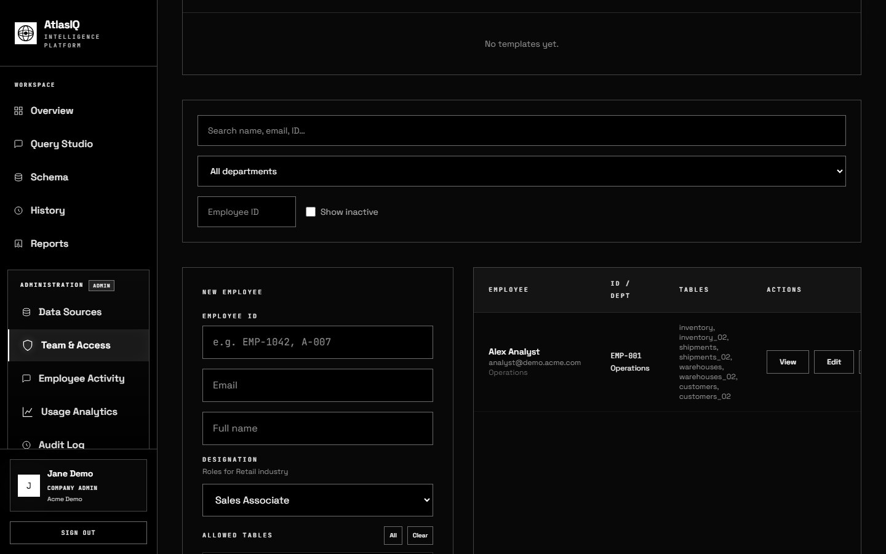
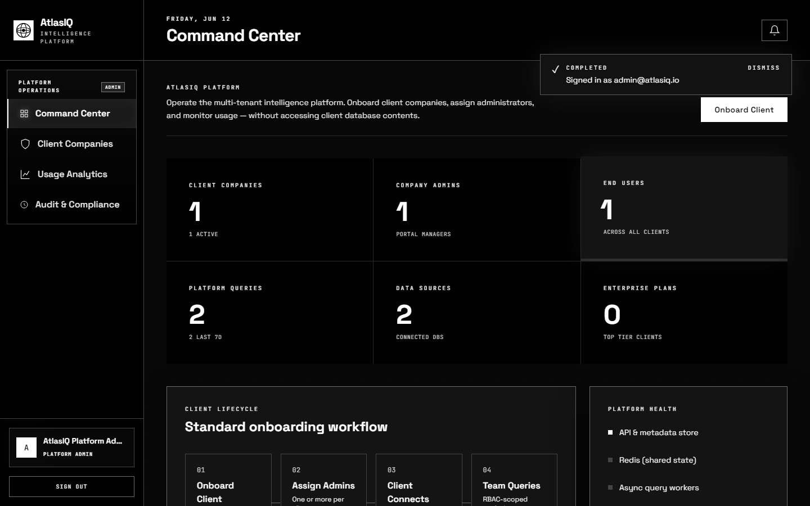
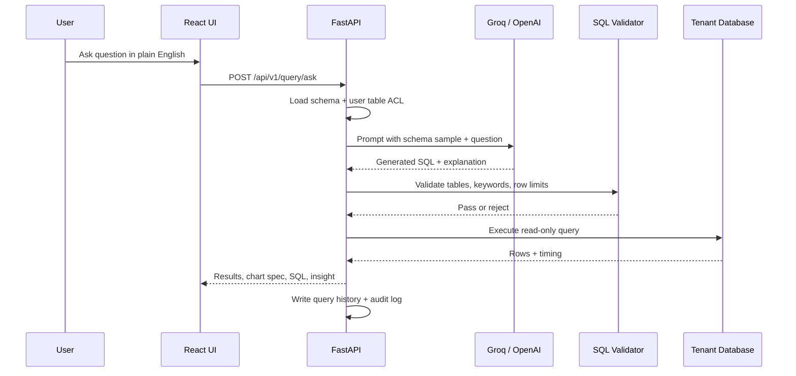
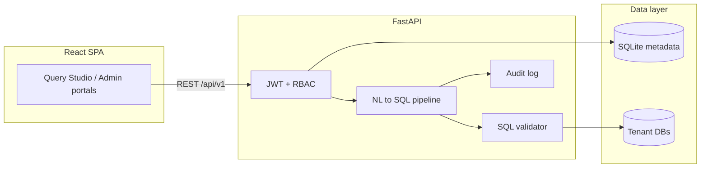

# AtlasIQ

[](https://atlasiq-sunc.onrender.com)
[](https://github.com/veera-1175/AtlasIQ)
[](LICENSE)

**Natural language → SQL analytics platform** with multi-tenant RBAC, audit logging, and automated reports.
> Built by [Veera](https://github.com/veera-1175).

<p align="center">
  
</p>

---

## Table of contents

- [Live demo](#live-demo)
- [What is AtlasIQ?](#what-is-atlasiq)
- [Screenshots](#screenshots)
- [Key features](#key-features)
- [How it works (NL → SQL pipeline)](#how-it-works-nl--sql-pipeline)
- [Roles & permissions](#roles--permissions)
- [Architecture](#architecture)
- [Tech stack](#tech-stack)
- [Quick start (local)](#quick-start-local)
- [Demo accounts](#demo-accounts)
- [Suggested interview walkthrough](#suggested-interview-walkthrough)
- [Project structure](#project-structure)
- [API overview](#api-overview)
- [Data & persistence](#data--persistence)
- [Testing](#testing)
- [Deployment](#deployment)
- [Environment variables](#environment-variables)
- [Author](#author)

---

## Live demo

| | |
|---|---|
| **URL** | [https://atlasiq-sunc.onrender.com](https://atlasiq-sunc.onrender.com) |
| **Best login for demos** | `admin@demo.acme.com` / `Demo@2026` |
| **Stack** | Docker on [Render](https://render.com) free tier |

> **Note:** Free-tier hosts sleep after ~15 minutes of inactivity. The first visit may take 30–60 seconds to wake up. Demo data is re-seeded automatically on each deploy.

---

## What is AtlasIQ?

Business teams need answers from relational databases, but most people do not write SQL. Giving everyone raw database access is also unsafe.

**AtlasIQ solves both problems:**

1. **Ask questions in plain English** — an LLM generates SQL against your schema.
2. **Enforce access control** — employees only see tables assigned by their company admin.
3. **Give admins visibility** — audit logs, usage analytics, team management, and scheduled reports.

This is a **working MVP / demo application**, not a production SaaS product. It is designed to be cloned, run locally, and walked through in technical interviews.

---

## Screenshots

### Query Studio — natural language to SQL, charts, and insights

Ask a business question, get validated SQL, a plain-English explanation, and an auto-generated chart.

<p align="center">
  
</p>

### Company admin dashboard

Overview of team activity, data sources, and workspace navigation.

<p align="center">
  
</p>

### Query Studio workspace

Schema focus tables, suggestions, and the query input panel.

<p align="center">
  
</p>

### Team & access management

Company admins manage employees, table-level permissions, and access requests.

<p align="center">
  
</p>

### Platform admin (super admin)

Multi-tenant command center for client companies across the platform.

<p align="center">
  
</p>

---

## Key features

| Area | What AtlasIQ does |
|------|-------------------|
| **NL → SQL** | Groq/OpenAI converts questions to SQL with schema context, clarification prompts, and auto-retry on SQL errors |
| **SQL safety** | Allow-list validation blocks destructive statements; queries are scoped to permitted tables |
| **RBAC** | Three roles: platform admin, company admin, employee — each with a dedicated UI |
| **Table ACL** | Per-employee allowed tables; queries outside scope are rejected |
| **Charts** | Auto bar/line/pie charts from result shape (Recharts) |
| **Reports** | Schedule recurring queries (daily/weekly) with CSV export |
| **Audit trail** | Login, query, admin, and security events logged per company |
| **Analytics** | Usage stats, employee activity feeds, adoption metrics |
| **Connectors** | SQLite file upload + PostgreSQL/Redshift connection strings |
| **Ops** | Docker single-container image, Render blueprint, pytest suite, smoke test |

---

## How it works (NL → SQL pipeline)



**Design choices worth discussing in interviews:**

- **Schema sampling** — large warehouses send only the most relevant tables/columns to the LLM (token/cost control).
- **Cost estimation** — rough row-scan estimate shown before expensive queries run.
- **Clarification flow** — ambiguous questions return follow-up prompts instead of guessing.
- **Error correction** — failed SQL can be retried once with the database error fed back to the LLM.

---

## Roles & permissions

| Role | Who | Can do |
|------|-----|--------|
| **Platform admin** | AtlasIQ operator | Manage client companies, platform analytics, cross-tenant audit |
| **Company admin** | e.g. Jane Demo @ Acme | Upload/connect data sources, manage employees, assign table access, view audit & usage |
| **Employee** | e.g. Alex Analyst | Query Studio on assigned tables only, view own history and usage |

Each role gets a **separate navigation shell** — switching accounts resets the page so roles never leak into each other.

---

## Architecture



| Layer | Responsibility |
|-------|----------------|
| **Frontend** | Role-based SPA, typed API client, charts, modals, notifications |
| **API** | Auth, query pipeline, admin CRUD, reports scheduler, audit |
| **Metadata DB** | Users, companies, permissions, history, reports (`backend/data/app.db` locally) |
| **Tenant DBs** | Uploaded SQLite files or connected Postgres/Redshift warehouses |

---

## Tech stack

| | Technologies |
|---|-------------|
| **Backend** | Python 3.11, FastAPI, Pydantic, SQLite, APScheduler |
| **Frontend** | React 18, TypeScript, Vite, Tailwind CSS, Recharts |
| **AI** | Groq API (Llama family), OpenAI-compatible fallback |
| **Auth** | JWT (python-jose), bcrypt password hashing |
| **Optional** | Redis + Celery for async jobs, S3-compatible object storage |
| **Deploy** | Docker, Render (`render.yaml`), Cloudflare Tunnel for local sharing |

---

## Quick start (local)

**Prerequisites:** Python 3.11+, Node.js 18+, a free [Groq API key](https://console.groq.com)

```powershell
git clone https://github.com/veera-1175/AtlasIQ.git
cd AtlasIQ
copy .env.example .env
# Edit .env — set GROQ_API_KEY=your_key_here
.\run.ps1
```

| Service | URL |
|---------|-----|
| **UI** | http://localhost:5173 |
| **API docs** | http://localhost:8000/docs |
| **Health** | http://localhost:8000/api/v1/health |

On first startup the app seeds a **demo tenant** (Acme Demo) with sample sales data automatically.

---

## Demo accounts

| Role | Email | Password | Use for |
|------|-------|----------|---------|
| Platform admin | `admin@atlasiq.io` | `AtlasIQ@2026` | Show multi-tenant company management |
| **Company admin** | `admin@demo.acme.com` | `Demo@2026` | **Best default for interviews** |
| Employee | `analyst@demo.acme.com` | `Demo@2026` | Show table-level ACL restrictions |

The login page includes one-click demo buttons for each role.

---

## Suggested interview walkthrough (~10 minutes)

1. **Open live demo** → log in as **company admin** (`admin@demo.acme.com`).
2. **Query Studio** → ask: *"Which region had the highest revenue in Q1?"*
   - Show generated SQL, insight text, bar chart, and execution time.
3. **Switch to employee** → same question works only on **assigned tables**; mention ACL enforcement in the validator.
4. **Team & Access** → show employee list, table permissions, password/access request workflows.
5. **Audit Log** → point out immutable-style event trail for compliance conversations.
6. **Architecture** → walk through the mermaid diagram: JWT → LLM → validator → tenant DB.
7. **Code** → open `backend/app/services/sql_generator.py` and `sql_validator.py` if time allows.

**Sample questions that work on the seeded `sales.db`:**

- "Which region had the highest revenue in Q1?"
- "Top 5 customers by total sales"
- "Monthly revenue trend for North America"

---

## Project structure

```
AtlasIQ/
├── backend/
│   ├── app/
│   │   ├── routers/          # REST endpoints (auth, query, admin, company, …)
│   │   ├── services/         # NL→SQL, validator, scheduler, cost estimator
│   │   ├── core/             # Database, permissions, config, security
│   │   └── models/           # Pydantic request/response schemas
│   ├── scripts/
│   │   ├── seed_demo.py      # Creates Acme Demo tenant + users
│   │   ├── create_sample_db.py
│   │   └── smoke_test.py     # End-to-end API smoke test
│   └── tests/                # pytest unit tests
├── frontend/src/
│   ├── components/           # Role-specific UI (platform, company, employee)
│   ├── api.ts                # Typed fetch client
│   └── roles.ts              # Page routing per role
├── docs/screenshots/         # README screenshots (captured from live demo)
├── sample_data/sales.db      # Seeded demo warehouse (committed to Git)
├── Dockerfile                # Production: React build + FastAPI on one port
├── docker-entrypoint.sh      # Seed demo + start uvicorn
├── render.yaml               # Render Blueprint (free HTTPS deploy)
└── run.ps1                   # Local dev: backend + frontend
```

---

## API overview

Base path: `/api/v1`

| Router | Examples |
|--------|----------|
| `auth` | `POST /auth/login`, `GET /auth/me` |
| `query` | `POST /query/ask`, `GET /query/history` |
| `databases` | `GET /databases`, `POST /databases/upload` |
| `company` | Team management, analytics, audit log |
| `employee` | Profile, usage, table access requests |
| `admin` | Platform stats, company CRUD (super admin) |
| `reports` | Scheduled report CRUD + manual run |

Interactive docs: `http://localhost:8000/docs` when running locally.

---

## Data & persistence

| Path | In Git? | Purpose |
|------|---------|---------|
| `sample_data/sales.db` | Yes | Small demo warehouse — copied into each new tenant |
| `backend/data/app.db` | **No** (gitignored) | Runtime metadata: users, companies, history |
| `backend/data/uploads/` | **No** | Uploaded customer database files |
| `.env` | **No** | API keys and secrets |

**Why runtime data is not committed:** it contains password hashes, query history, and user uploads. On Render, demo data is rebuilt on every deploy via `seed_demo.py`.

---

## Testing

```powershell
# Unit tests
backend\venv\Scripts\python -m pytest backend/tests

# Smoke test (health + login + query)
backend\venv\Scripts\python backend\scripts\smoke_test.py
```

---

## Deployment

### Render (free HTTPS, no custom domain)

1. Fork or use this repo: [github.com/veera-1175/AtlasIQ](https://github.com/veera-1175/AtlasIQ)
2. [Render Dashboard](https://dashboard.render.com) → **New** → **Blueprint** → connect repo
3. Set `GROQ_API_KEY` when prompted
4. Deploy — you get a `*.onrender.com` URL

Or use the included [`render.yaml`](render.yaml) spec directly.

### Docker (single container)

```powershell
docker build -t atlasiq .
docker run -p 8000:8000 -e GROQ_API_KEY=your_key -e PORT=8000 atlasiq
```

Open http://localhost:8000 — UI and API share one port.

### Share a local demo (interview on same laptop)

```powershell
.\scripts\tunnel.ps1
```

Uses [Cloudflare quick tunnel](https://developers.cloudflare.com/cloudflare-one/connections/connect-networks/do-more-with-tunnels/trycloudflare/) to expose your local `run.ps1` instance.

---

## Environment variables

Copy [`.env.example`](.env.example) to `.env`. Minimum required for local dev:

| Variable | Required | Description |
|----------|----------|-------------|
| `GROQ_API_KEY` | Yes | LLM provider key for Query Studio |
| `JWT_SECRET` | Prod | Signs auth tokens |
| `COMPANY_DATA_KEY` | Prod | Encrypts sensitive company fields |
| `ATLASIQ_SUPER_ADMIN_PASSWORD` | No | Platform admin password (default `AtlasIQ@2026`) |

On Render, `RENDER_EXTERNAL_URL` is detected automatically for CORS and public links.

---

## Author

**Veera**

- GitHub: [@veera-1175](https://github.com/veera-1175)
- Repository: [github.com/veera-1175/AtlasIQ](https://github.com/veera-1175/AtlasIQ)
- Live demo: [atlasiq-sunc.onrender.com](https://atlasiq-sunc.onrender.com)

If you are reviewing this for hiring, I can walk through the NL→SQL pipeline, RBAC model, or any module live in about 10 minutes.

---

<p align="center">
  <sub>MIT License · Built with FastAPI, React, and Groq · Portfolio project 2026</sub>
</p>
